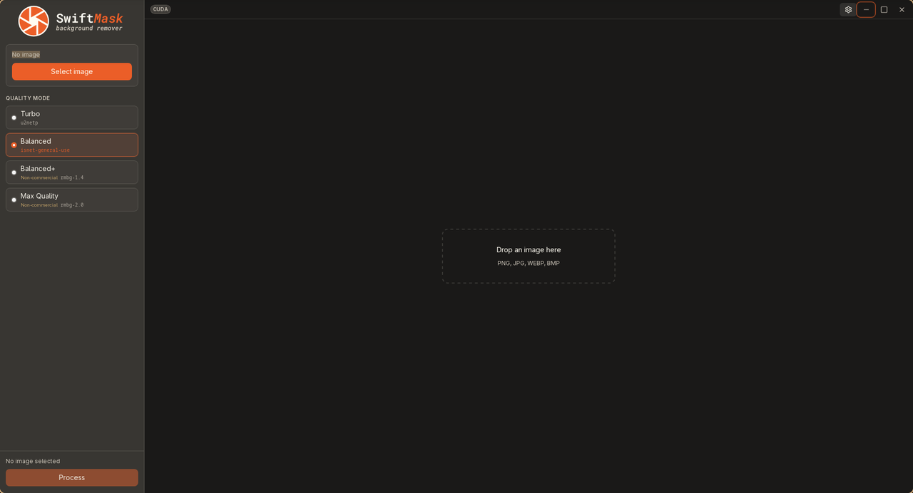
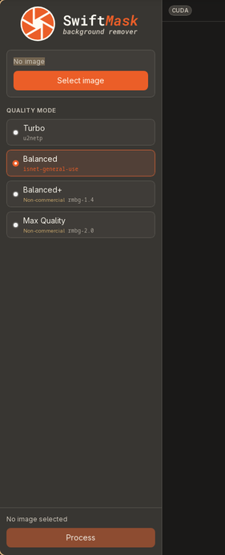
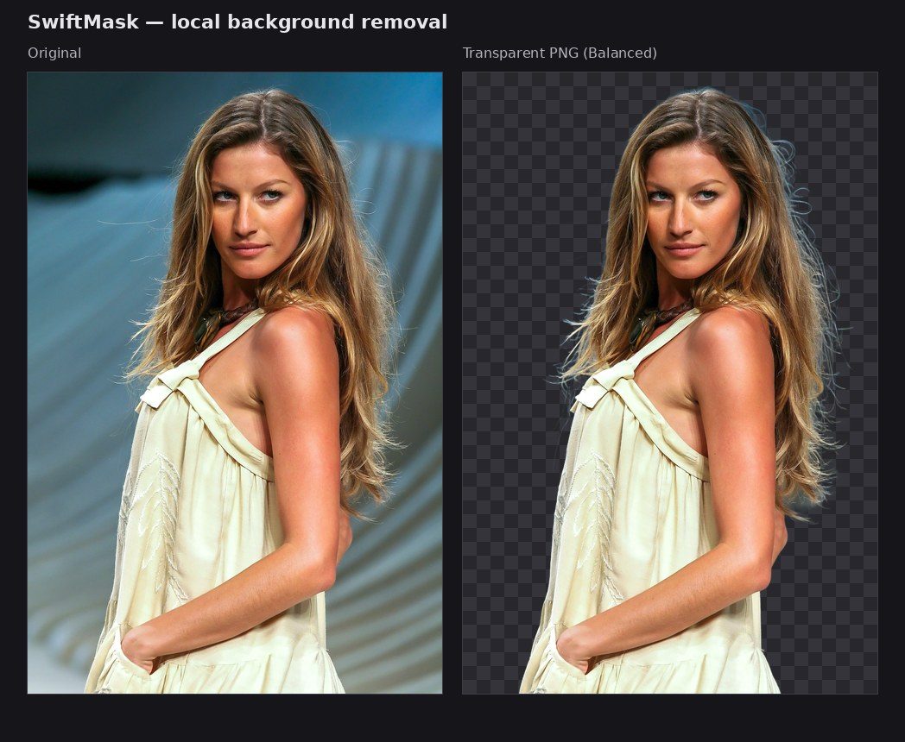
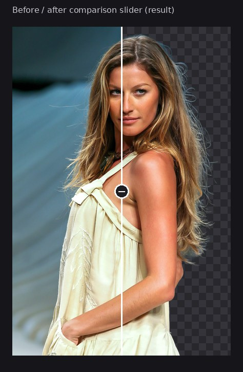

# SwiftMask

A desktop app that removes image backgrounds **locally** using ONNX models. No cloud upload, no account, no telemetry.

Built with [Tauri 2](https://v2.tauri.app), React, and Rust ([ONNX Runtime](https://onnxruntime.ai) via `ort`).



*Main window — quality modes on the left, drop target on the right. The **CUDA** chip shows the active execution provider (your machine may show CPU or DirectML instead).*

## Download

Prebuilt installers are published on **[GitHub Releases](https://github.com/camilopaezz/SwiftMask/releases)**.

### Linux (AppImage)

```bash
chmod +x swiftmask-linux.AppImage
./swiftmask-linux.AppImage
```

- No install step required.
- **NVIDIA GPU (optional):** install proprietary drivers as usual. SwiftMask selects CUDA when the stack is available; otherwise it uses CPU.
- If the window is blank or glitchy on some WebKit/GTK setups, try:

  ```bash
  WEBKIT_DISABLE_COMPOSITING_MODE=1 ./swiftmask-linux.AppImage
  ```

- If your desktop cannot run AppImages (missing FUSE), use the `.deb` / `.rpm`, or extract with `./swiftmask-linux.AppImage --appimage-extract`.

### Linux (.deb)

```bash
sudo dpkg -i swiftmask-linux.deb
# if dependencies are missing:
sudo apt-get install -f
```

### Linux (.rpm)

```bash
# Fedora / RHEL-family
sudo dnf install ./swiftmask-linux.rpm
# or
sudo rpm -i swiftmask-linux.rpm
```

### Windows (NSIS or MSI)

1. Download `swiftmask-windows-setup.exe` (NSIS) or `swiftmask-windows.msi` (MSI) from the release.
2. Run the installer.
3. **SmartScreen** may warn on unsigned builds — choose *More info* → *Run anyway* if you trust the release source. Signing is planned for later releases.

### First launch

On first run the app **benchmarks** available execution providers (CPU, CUDA on Linux NVIDIA, DirectML on Windows) and picks the fastest for your hardware. You can override this anytime in **Settings**.

## Features

- **Local inference** — images never leave your machine
- **Multiple quality modes** — from a fast bundled model to larger downloadable ones
- **GPU acceleration** — CUDA on Linux (NVIDIA), DirectML on Windows; CPU fallback everywhere
- **Drag and drop** — open images from the file picker or drop them on the preview pane
- **Before/after slider** — scrub between input and output after processing

Supported input formats: **PNG, JPG, WEBP, BMP**.

## Quality modes

| Mode | Model | Size | License |
|------|-------|------|---------|
| **Turbo** | u2netp | ~4.5 MB | Apache-2.0 (bundled; always available) |
| **Balanced** | isnet-general-use | ~178 MB | Apache-2.0 (download on first use; good default) |
| **Balanced+** | rmbg-1.4 | ~176 MB | [CC BY-NC 4.0](https://creativecommons.org/licenses/by-nc/4.0/) (download on first use) |
| **Max Quality** | rmbg-2.0 | ~173 MB | [CC BY-NC 4.0](https://creativecommons.org/licenses/by-nc/4.0/) (download on first use) |



Downloads are verified with **SHA-256** before use and cached under the app data directory (`models/`).  

## How to use

1. **Open an image** — click **Select image**, or drop a file on the preview pane (`Ctrl+O` / `⌘O`).
2. **Pick a quality mode** — Turbo is always ready; other modes download on first use.
3. Click **Process** (`Ctrl+Enter` / `⌘Enter`). Cancel with **Escape** while a job is running.
4. Use the **comparison slider** to check the result. Output is saved as a transparent PNG.





Default output name: `{original-stem}-nobg-{modelId}.png` next to the input (or in the folder you set in Settings). If that file already exists, SwiftMask asks before overwriting.

## Troubleshooting

| Problem | What to try |
|---------|-------------|
| **Blank / black window (Linux)** | Launch with `WEBKIT_DISABLE_COMPOSITING_MODE=1`. Some Arch/CachyOS WebKit builds need this. |
| **AppImage won’t start** | `chmod +x` the file. Ensure FUSE is available, extract with `./swiftmask-linux.AppImage --appimage-extract`, or install the `.deb` / `.rpm` instead. |
| **CUDA not used (Linux)** | Install proprietary NVIDIA drivers. The title-bar chip should read **CUDA** when active. Without drivers, CPU is used automatically. |
| **Windows SmartScreen** | Expected for unsigned builds — *More info* → *Run anyway* if you trust the release. |
| **Download fails** | Check network access to GitHub / Hugging Face. Incomplete files are re-downloaded and re-verified. |
| **Out of memory on large images** | Use a smaller mode (Turbo/Balanced) or a smaller source image. GPU OOM may automatically retry on CPU when the backend can detect it. |
| **Need a commercial workflow** | Use **Turbo** or **Balanced** (Apache-2.0 models). Do not use Balanced+ / Max Quality for commercial work unless you have a separate license from the model rights holder. |

## Feedback & issues

Report bugs and feature requests on **[GitHub Issues](https://github.com/camilopaezz/SwiftMask/issues)**. Include OS, app version (Settings), execution provider chip, and what you were doing when it failed.

---

## Development

### Prerequisites

- [Bun](https://bun.sh) — package manager (`bun.lock` is canonical; do not commit `package-lock.json`)
- [Rust](https://rustup.rs) 1.88+ (stable)
- Platform libraries for Tauri — see [Tauri prerequisites](https://v2.tauri.app/start/prerequisites/)

**Optional GPU support**

- **Linux + NVIDIA**: recent proprietary drivers; CUDA execution provider is selected automatically when detected
- **Windows**: DirectML via the system GPU stack (no separate CUDA install)

### Quick start

```bash
bun install
bun run tauri dev
```

This starts the Vite dev server and opens the desktop window. On first launch the app benchmarks available execution providers and may prompt you to download a preferred model.

## License

SwiftMask is open source under the [MIT License](LICENSE). That covers the application itself — UI, Tauri shell, inference pipeline, and tooling.

The ONNX **models are third-party works** with their own terms (see the table above and `src-tauri/src/models.rs`). SwiftMask downloads and runs them on your machine; it does not relicense them.

### Model licenses and commercial use

| Mode | Can end users use outputs commercially? |
|------|----------------------------------------|
| Turbo, Balanced | Generally yes, under [Apache-2.0](https://www.apache.org/licenses/LICENSE-2.0) (attribution and license notice as required by Apache) |
| Balanced+, Max Quality | **No** — [CC BY-NC 4.0](https://creativecommons.org/licenses/by-nc/4.0/) allows non-commercial use only |

The **non-commercial restriction applies to people who use the RMBG models** (Balanced+ and Max Quality), not to publishing SwiftMask as free software. If you process images for paid work, client deliverables, product photography, or other commercial purposes, use **Turbo** or **Balanced**, or obtain a separate commercial license from the model rights holder ([BRIA](https://bria.ai/) for RMBG-1.4 / RMBG-2.0).

This section is a plain-language summary, not legal advice.
